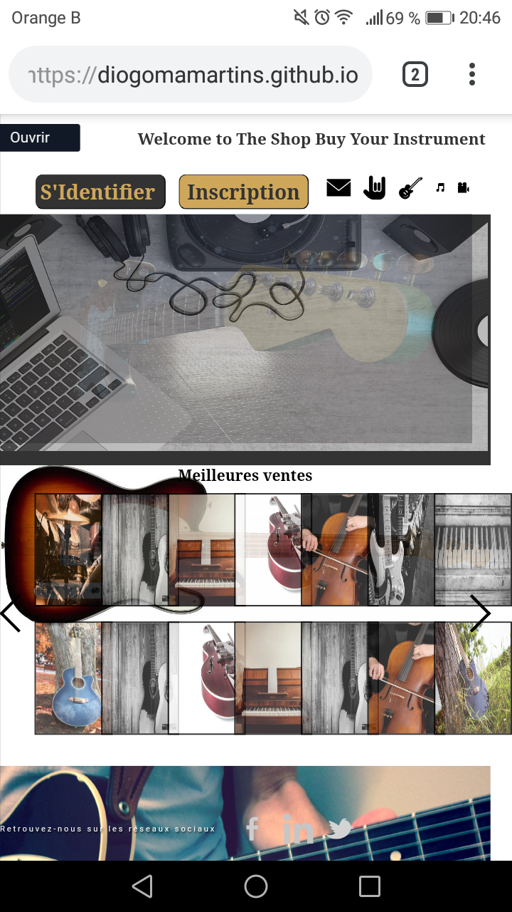
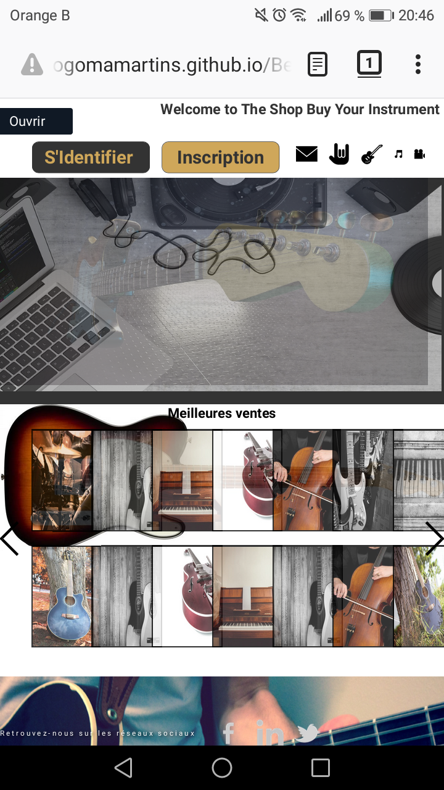
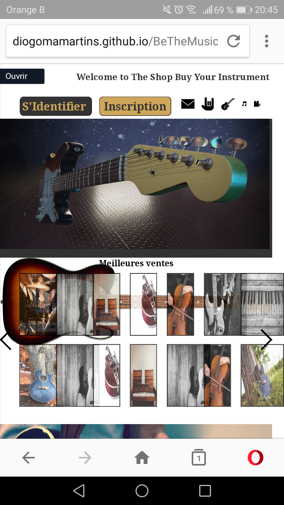
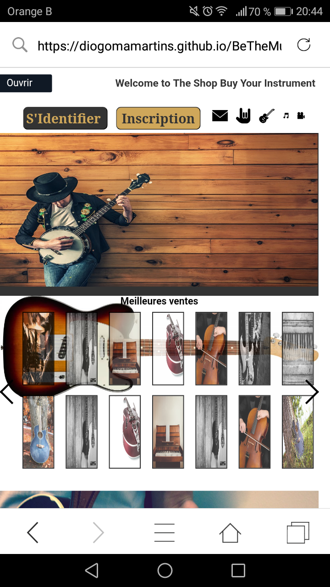

__BeTheMusic__ 
 _Best website to buy yours instruments_
 __About__
_Site web d’une page d’un magasin de musique, conçu par louis878 (https://github.com/louis878) et moi-même, réalisé dans le cadre d’un atelier BeCode . Lire les consignes : 
 https://github.com/becodeorg/Swartz-2/blob/master/Projects/Pair-One-Pager.md
Le site web est responsive et est entièrement réalisé en HTML et CSS.
https://diogomamartins.github.io/BeTheMusic/_
__See__
[site]("https://diogomamartins.github.io/BeTheMusic/")
:------:
            **GoogleChrome** 

            :------:

:------:
          
  **Firefox** 

  :------:

                    **Opera** 

 
 :------:
               **Safari** 

